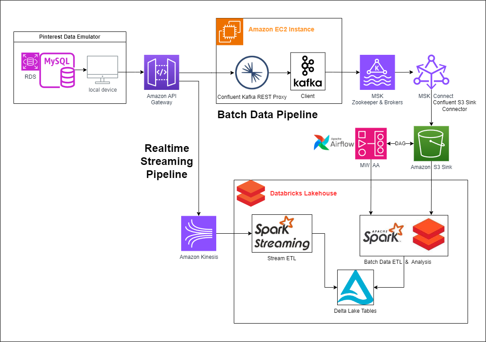
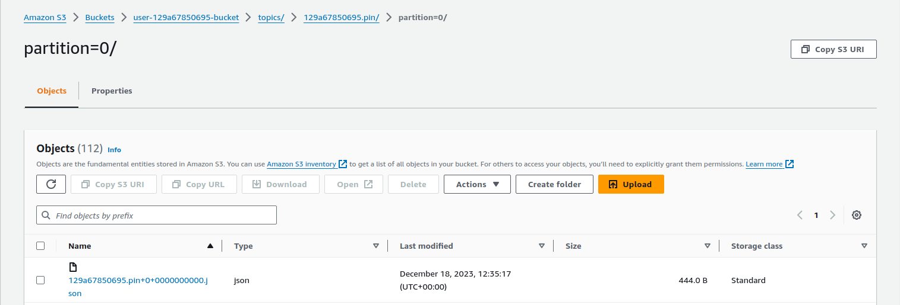
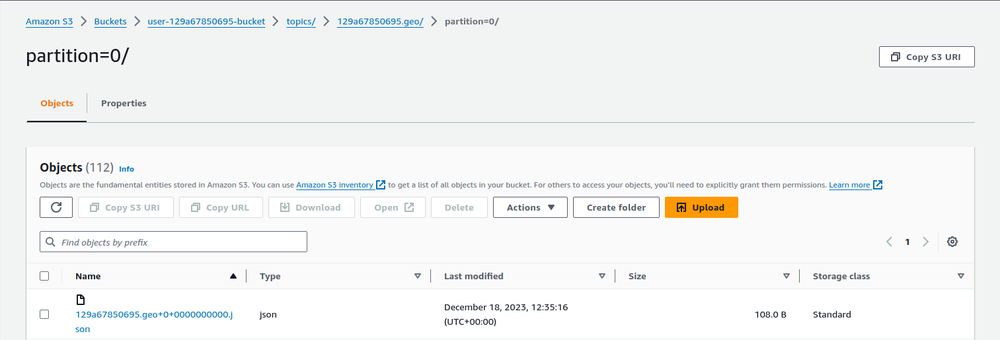
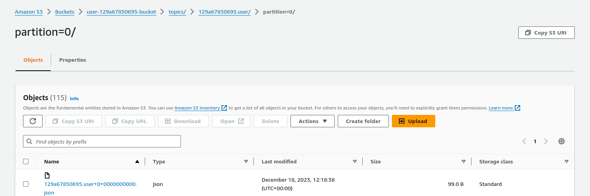

# Pinterest Data Pipeline

## Table of Contents
 - [Description](#description)
   * [Pipeline Architecture](#pipeline-architecture)
   * [Technoligies Used](#technologies-used)
   * [Project Highlights](#project-highlights)
 - [Install Instructions](#install-instructions)
 - [Creating the Pipelines](#creating-the-pipelines)
   * [Kafka Client running on EC2](#kafka-client-running-on-ec2)
   * [MSK Connect](#msk-connect)
   * [API Gateway and Kafka REST Proxy](#api-gateway-and-kafka-rest-proxy)
    * [Pinterest User Posting Emulator](#pinterest-user-posting-emulator)
    * [Databricks]
 - [Usage Instructions](#Usage-Instructions)
 - [File Structure](#File-Structure)
 - [License](#License)

## Description
This project aims to create use AWS Cloud to create a system similar to Pinterest that is capable of crunching billions of data points a data to help decide how to provide more value to the users. \

### Pipeline Architecture
The pipeline implemented is a Lambda architecture where you have both a batch processing pipeline and a streaming pipeline in parallel.


#### Data Ingestion
Data is sent to the API from the user_posting_emulation.py script, which provides a real-time stream of data, ready to be ingested and processed. user_posting_emulation.py works by generating an infinite loop of Pinterest posts extracted from a database. In the batch pipeline, the API forwards the data to the Kafka Client machine where acting as a producer, it publishes (writes) events to Kafka topics and MSK drops it in the S3 data lake sink.
In the streaming pipeline, the API forwards the data to AWS Kinesis.

#### Data Processing
Apache Spark handles the data cleaning and normalisation using PySpark running on Databricks. In the batch processing pipeline, the data is extracted from the S3 data lake and processed with Spark. In the streaming pipeline, data is read into a Spark Streaming data frame from Kinesis, allowing for transformations to be applied in real-time.

#### Data Orchestration
Apache Airflow is a task scheduling platform which allows tasks to be created and managed. In this project, the Spark cleaning and normalisation tasks for the batch processing job have been automated to run once a day.

#### Data Storage
For the batch processing pipeline, data is stored in the S3 data lake before being subsequently processed. For the streaming pipeline, the transformations are applied to incoming data stream. In both cases the cleaned data is output to Delta tables in the Databricks Delta Lakehouse. 

#### Data Analysis
Further computations were done on the data, including a count of the total number of posts per category and category popularity (mean follower count per category). The results of these were also sent to the Lakehouse for permanent storage.

### Technologies Used:
- AWS Elastic Cloud Compute (EC2): Scalable on-demand computing capacity in the cloud.
- Apache Kafka: Used as a scalable and fault-tolerant messaging system for data streaming.
- AWS Managed Streaming for Apache Kafka (MSK): Managed service for Apache Kafka, providing easy setup, monitoring, and scaling capabilities.
- MSK Connect: Enables seamless data integration between Apache Kafka and other data sources and sinks.
- AWS API Gateway: Used to create, publish, and manage APIs, allowing external interaction with the pipeline.
- AWS S3: Scalable object storage used for data storage and retrieval.
- AWS Kinesis: Managed service for real-time data streaming and processing.
- Apache Spark: Fast and distributed processing engine used for data transformations and analytics.
- Apache Spark Structured Streaming: Enables real-time processing and analysis of streaming data.
- Databricks: Cloud-based platform for collaborative data engineering and analytics.
- Apache Airflow: Open-source platform for orchestrating and scheduling workflows.
- AWS Managed Workflows for Apache Airflow (MWAA): Fully managed service for Apache Airflow, simplifying the deployment and management of workflows.

### Project Highlights
- Developed a robust data processing pipeline capable of handling large scale experimental data requirements. 
- Implemented a Lambda architecture, combining batch processing and stream processing methods. 
- Leveraged Kafka, MSK and Kinesis to handle scalable and fault-tolerant data streaming. 
- Utilized Spark and Spark Structured Streaming for real-time data processing and analytics.
- Integrated various data sources and sinks using APIs and MSK Connect for seamless data integration.
- Ensured data storage and retrieval using AWS S3 and Databricks Delta Tables.
- Orchestrated and scheduled workflows using Airflow and MWAA for efficient pipeline management.

## Install Instructions
Although much of the work in this project is configuring the tech stack in the cloud, this repository contains this documentation and some python code to be run locally.

To clone this Github repository, run the following: 
```bash
git clone https://github.com/RegnixS/pinterest-data-pipeline.git <your_repo>
```

The python code requires Python 3.11.5 and the following packages:
- python-dotenv
- requests
- sqlalchemy

A Conda environment can be created from the requirements.txt file in this repository by: 
```bash
conda create -n <your_env> --file requirements.txt
```

## Creating the pipelines
The following is a step by step guide of how to create both the batch and streaming pipelines.

### Kafka Client running on EC2 
A Kafka client is installed on an Amazon EC2 virtual machine. \
This machine will act as the client for the Brokers and Zookeeper servers running in AWS MSK (Managed Streaming for Apache Kafka). 

First, retrieve the key pair for the EC2 instance (in this case from the Parameter Store) and save it locally. \
This allows access to the EC2 instance using SSH.

The following components are installed on the EC2 instance:
- Java 1.8.0
```bash
sudo yum install java-1.8.0
```
- Kafka 2.12-2.8.1
```bash
wget https://archive.apache.org/dist/kafka/2.8.1/kafka_2.12-2.8.1.tgz  
tar -xzf kafka_2.12-2.8.1.tgz
```
- IAM MSK Authentication package
```bash
wget https://github.com/aws/aws-msk-iam-auth/releases/download/v1.1.5/aws-msk-iam-auth-1.1.5-all.jar
```

The path to the IAM MSK Authentication package's .jar file must be added to CLASSPATH in .bashrc.
```bash
export CLASSPATH=/home/ec2-user/kafka_2.12-2.8.1/libs/aws-msk-iam-auth-1.1.5-all.jar
```

An IAM role for the EC2 instance to access MSK needs to be configured and added to the client.properties file in the kafka*/bin directory as shown below:
```
# Sets up TLS for encryption and SASL for authN.
security.protocol = SASL_SSL

# Identifies the SASL mechanism to use.
sasl.mechanism = AWS_MSK_IAM

# Binds SASL client implementation.
sasl.jaas.config = software.amazon.msk.auth.iam.IAMLoginModule required awsRoleArn="<IAM Access Role>";

# Encapsulates constructing a SigV4 signature based on extracted credentials.
# The SASL client bound by "sasl.jaas.config" invokes this class.
sasl.client.callback.handler.class = software.amazon.msk.auth.iam.IAMClientCallbackHandler
```

The following Kafka topics are created using:
```bash
<KAFKA_FOLDER>/bin/kafka-topics.sh --bootstrap-server BootstrapServerString --command-config client.properties --create --topic <topic_name>
```
- 129a67850695.pin
- 129a67850695.geo
- 129a67850695.user

### MSK Connect
MSK Connect is a feature of AWS MSK that allows users to stream data to and from their MSK hosted Apache Kafka clusters. 

In this case, a sink connecter is created to move data into an Amazon S3 bucket.

The MSK cluster and S3 bucket are already provided so all we need to do is create the connector and associated plugin.

First create the custom plugin. \
The plugin contains code that defines the logic of the connector. These connectors already exist so we don't need to write the code for them. \
The one we are using is the **Confluent.io Amazon S3 Connector** which will export data from Kafka topics to S3 objects in either JSON, Avro or Bytes format.

Using the EC2 instance from earlier, download the plugin and upload it to the S3 bucket where MSK will be able to find it:
```bash
# assume admin user privileges
sudo -u ec2-user -i
# create directory where we will save our connector
mkdir kafka-connect-s3 && cd kafka-connect-s3
# download connector from Confluent
wget https://d1i4a15mxbxib1.cloudfront.net/api/plugins/confluentinc/kafka-connect-s3/versions/10.0.3/confluentinc-kafka-connect-s3-10.0.3.zip
# copy connector to our S3 bucket
aws s3 cp ./confluentinc-kafka-connect-s3-10.0.3.zip s3://<BUCKET_NAME>/kafka-connect-s3/
``` 
In the MSK console, select **Custom plugins** under the **MSK Connect** section. Choose **Create custom plugin**. \
For **S3 URI Custom plugin object**, find the ZIP file uploaded in the bucket and press **Create custom plugin**.

In the MSK console, select **Connectors** under the **MSK Connect** section. Choose **Create connector**. \
Select the plugin you have just created, and then click **Next**. \
The configuration settings of note are:
- **Connector configuration settings** 
```
connector.class=io.confluent.connect.s3.S3SinkConnector
# same region as our bucket and cluster
s3.region=us-east-1
flush.size=1
schema.compatibility=NONE
tasks.max=3
# include nomeclature of topic name, given here as an example will read all data from topic names starting with msk.topic....
topics.regex=<YOUR_UUID>.*
format.class=io.confluent.connect.s3.format.json.JsonFormat
partitioner.class=io.confluent.connect.storage.partitioner.DefaultPartitioner
value.converter.schemas.enable=false
value.converter=org.apache.kafka.connect.json.JsonConverter
storage.class=io.confluent.connect.s3.storage.S3Storage
key.converter=org.apache.kafka.connect.storage.StringConverter
s3.bucket.name=<BUCKET_NAME>
```
- **Worker Configuration** Select **Use a custom configuration**, then pick **confluent-worker**. (This is a custom worker configuration that was created to manage storage partition sizes.)
- **Access permissions** Select the IAM role previously used for the EC2 instance.

### API Gateway and Kafka REST Proxy
By installing a Confluent REST Proxy for Kafka on the EC2 instance, we can post data from the Pinterest emulator to a REST API on the Amazon API Gateway which in turn sends it via the proxy to update the Kafka topics on the MSK cluster without having to create and maintain producer programs locally on the EC2 instance. 

In the API Gateway console, create a REST type API with regional endpoint.

Create a proxy resource with an ```ANY``` method like so:


The **Endpoint URL** is the **Public IPv4 DNS** of the EC2 instance with the Kafka client. \
**8082** is the default port the Confluent REST Proxy listens to.

Creating a {proxy+} resource with HTTP proxy integration allows a streamlined setup where the API Gateway submits all request data directly to the backend with no intervention from API Gateway. \
All requests and responses are handled by the backend - in this case the Confluent REST Proxy on the EC2 instance.

Deploy the API:

Once deployed, the API is now accessible from the web.

Install the Confluent Kafka REST Proxy on the EC2 instance:
```bash
sudo wget https://packages.confluent.io/archive/7.2/confluent-7.2.0.tar.gz
tar -xvzf confluent-7.2.0.tar.gz
```
Configure the Kafka REST Proxy properties so it can comminucate with the MSK cluster, but updating the following file:
```bash
<CONFLUENT_FOLDER>/etc/kafka-rest/kafka-rest.properties
```
Update the ```bootstrap.servers``` and ```zookeeper.connect``` properties and also add the following to allow IAM authentication:
```
# Sets up TLS for encryption and SASL for authN.
client.security.protocol = SASL_SSL

# Identifies the SASL mechanism to use.
client.sasl.mechanism = AWS_MSK_IAM

# Binds SASL client implementation.
client.sasl.jaas.config = software.amazon.msk.auth.iam.IAMLoginModule required awsRoleArn="Your Access Role";

# Encapsulates constructing a SigV4 signature based on extracted credentials.
# The SASL client bound by "sasl.jaas.config" invokes this class.
client.sasl.client.callback.handler.class = software.amazon.msk.auth.iam.IAMClientCallbackHandler
```

Start the proxy server from the ```confluent-7.2.0/bin``` folder:
```bash
./kafka-rest-start /home/ec2-user/confluent-7.2.0/etc/kafka-rest/kafka-rest.properties
```

The Kafka related modules are now ready to accept data from our Pinterest users.

### Pinterest User Posting Emulator
#### Data Source
In a MySQL database hosted on Amazon RDS in the cloud there resides 1000s of sample datasets that represent the information a Pinterest user may generate as they interact with their app. 
There are 3 records per interaction representing 'pin' data, 'geo' or location data and 'user' data.

The JSON formats of examples of each dataset are as follows:
```json
{'index': 7528, 'unique_id': 'fbe53c66-3442-4773-b19e-d3ec6f54dddf', 'title': 'No Title Data Available', 'description': 'No description available Story format', 'poster_name': 'User Info Error', 'follower_count': 'User Info Error', 'tag_list': 'N,o, ,T,a,g,s, ,A,v,a,i,l,a,b,l,e', 'is_image_or_video': 'multi-video(story page format)', 'image_src': 'Image src error.', 'downloaded': 0, 'save_location': 'Local save in /data/mens-fashion', 'category': 'mens-fashion'}

{'ind': 7528, 'timestamp': datetime.datetime(2020, 8, 28, 3, 52, 47), 'latitude': -89.9787, 'longitude': -173.293, 'country': 'Albania'}

{'ind': 7528, 'first_name': 'Abigail', 'last_name': 'Ali', 'age': 20, 'date_joined': datetime.datetime(2015, 10, 24, 11, 23, 51)}
```

The python program user_posting_emulation.py will randomly read datasets from this database at random intervals and then using the ```requests``` python library post them to the API we built earlier.

To run this program: \
```bash
python user_posting_emulation.py
```

#### Testing Data is ingested by Kafka
To test whether the emulation is working, the python program check_user_posting_emulation.py will create Kafka consumers using the API and then consume the messages and output them to the JSON files: 
- pin_consumer.json
- geo_consumer.json
- user_consumer.json

To run this program: \
```bash
python check_user_posting_emulation.py
```

The emulation can also be tested by running a consumer from the command line like so: 
```bash
./kafka-console-consumer.sh --bootstrap-server BootstrapServerString --consumer.config client.properties --group <consumer_group> --topic <topic_name> --from-beginning
```
The CLI command must be run on the EC2 instance where Kafka is installed, but the python programs can be run from any python environment anywhere there is an internet connection.

#### Testing Data has been ingested and stored in S3
To see if the data has gone through the Kafka via MSK and MSK Connect, we can look in the S3 data lake.




### Databricks and PySpark
#### Mount the S3 bucket to Databricks
In order to access the S3 bucket containing the Kafka topics data, we first need to allow access to the bucket. 
To do this we first need to create a user in IAM for the AWS account for Databricks to access. 
Attach the existing permission policy ```S3FullAccess```.
In **Security Credentials** for this user, **Create Access Key**.
Download the key as CSV file.
In the Databricks UI click **Catalog** and **Create Table**.
Drop the key CSV file in the space and click **Create Table with UI**.

Now that the access keys are available from within the Databricks file store, we can use them in our notebooks.

The first notebook **Mount S3 Bucket and Create Dataframes.ipynb** 
will perform the following tasks:
- Access the authentication csv file in Databricks file store.
- Read the access key information.
- Mount the S3 bucket using the bucket URI and access key information. 
- Read the pin data from: ```/mnt/<bucket_name>/topics/129a67850695.pin/partition=0/```
- Read the geo data from: ```/mnt/<bucket_name>/topics/129a67850695.geo/partition=0/```
- Read the user data from: ```/mnt/<bucket_name>/topics/129a67850695.user/partition=0/```
- Copy the dataframes to Global Temporary Views so they can be used in other notebooks.
- Unmount the S3 bucket. 


## Usage instructions
### Python files
#### user_posting_emulation.py : 
This program at random intervals, pulls random data from a mySQL database. \
This consists of a set of three datasets which are:
- details of the 'pin'
- details of a location from where this 'pin' originated
- details of a user who posted the 'pin' 

To run this program: \
```bash
python user_posting_emulation.py
```
To test whether the emulation is working, the python program check_user_posting_emulation.py will create Kafka consumers using the API and then consume the messages and output them to the JSON files: 
- pin_consumer.json
- geo_consumer.json
- user_consumer.json

To run this program: \
```bash
python check_user_posting_emulation.py
```
## File structure of the project:
user_posting_emulation.py 

Local Machine
|-- dags/
    |-- 0a3db223d459_dag.py
|-- databricks_notebooks/
    |-- access_keys.ipynb
    |-- data_cleaning_tools.ipynb
    |-- data_cleaning.ipynb
    |-- data_sql_query.ipynb
    |-- mount_s3_to_databricks.ipynb
    |-- stream_and_clean_kinesis_data.ipynb
|-- db/
    |-- aws_db_connector.py
|-- utils/
    |-- data_transformations.py
|-- batch_streaming.py
|-- kinesis_streaming.py
|-- README.md

EC2 Instance
|-- kafka_2.12-2.8.1/
    |-- bin/
        |-- client.properties
    |-- libs/
        |-- aws-msk-iam-auth-1.1.5-all.jar
|-- kafka-connect-s3/
    |-- confluentinc-kafka-connect-s3-10.0.3.zip
|-- confluent-7.2.0/
    |-- etc/
        |-- kafka-rest/
            |-- kafka-rest.properties

## License information:
MIT License

Copyright (c) 2023 Robert Ducke

Permission is hereby granted, free of charge, to any person obtaining a copy
of this software and associated documentation files (the "Software"), to deal
in the Software without restriction, including without limitation the rights
to use, copy, modify, merge, publish, distribute, sublicense, and/or sell
copies of the Software, and to permit persons to whom the Software is
furnished to do so, subject to the following conditions:

The above copyright notice and this permission notice shall be included in all
copies or substantial portions of the Software.

THE SOFTWARE IS PROVIDED "AS IS", WITHOUT WARRANTY OF ANY KIND, EXPRESS OR
IMPLIED, INCLUDING BUT NOT LIMITED TO THE WARRANTIES OF MERCHANTABILITY,
FITNESS FOR A PARTICULAR PURPOSE AND NONINFRINGEMENT. IN NO EVENT SHALL THE
AUTHORS OR COPYRIGHT HOLDERS BE LIABLE FOR ANY CLAIM, DAMAGES OR OTHER
LIABILITY, WHETHER IN AN ACTION OF CONTRACT, TORT OR OTHERWISE, ARISING FROM,
OUT OF OR IN CONNECTION WITH THE SOFTWARE OR THE USE OR OTHER DEALINGS IN THE
SOFTWARE.
