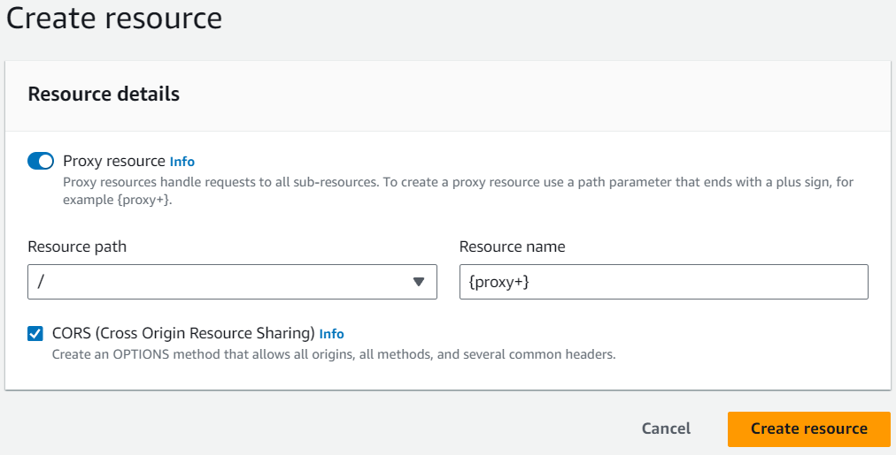
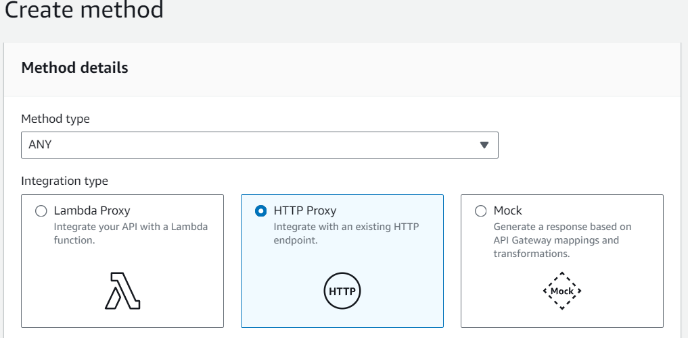
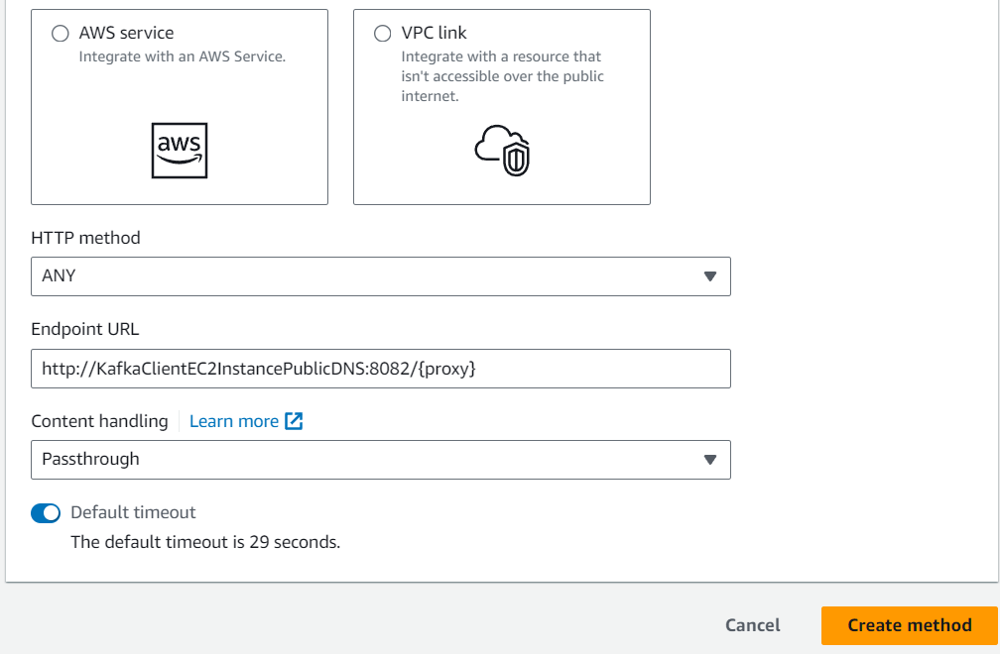
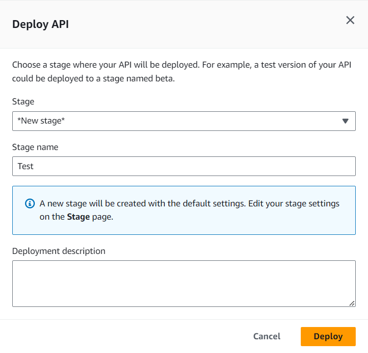

# pinterest-data-pipeline238

## Table of Contents
 - [Description](#Description)
 - [Install Instructions](#Install-Instructions)
 - [Creating the Pipelines](#creating-the-pipelines)
   * [Kafka Client running on EC2](#kafka-client-running-on-ec2)
   * [MSK Connect](#msk-connect)
   * [Kafka REST Proxy](#kafka-rest-proxy)

 - [Usage Instructions](#Usage-Instructions)
 - [File Structure](#File-Structure)
 - [License](#License)

## Description
This project aims to create a system for processing billions of records similar to Pinterest using AWS Cloud. \
Both batch and real-time streaming pipelines are implemented.

### Technologies Used:
- AWS (API Gateway, EC2, IAM, Kinesis, MSK, MWAA, RDS and S3)
- Apache (Kafka, Spark and Airflow)
- Databricks

An AWS account is provided with the following:
- An empty EC2 instance running Linux
- An MSK cluster
- An empty S3 bucket


## Install Instructions
To clone this Github repository, run the following: ```https://github.com/RegnixS/pinterest-data-pipeline238.git```

## Creating the pipelines

### Kafka Client running on EC2 
A Kafka client is installed on the EC2 virtual machine. This is where the source data from the Pinterest emulator will be initially fed using web APIs.

This machine will act as the client for the Brokers and Zookeeper servers running in AWS MSK (Managed Streaming for Apache Kafka). 

First, retrieve the key pair for the EC2 instance (in this case from the Parameter Store) and save it locally. \
This allows access to the EC2 instance using SSH.

The following components are installed on the EC2 instance:
- Java 1.8.0 \
```sudo yum install java-1.8.0```
- Kafka 2.12-2.8.1 \
```wget https://archive.apache.org/dist/kafka/2.8.1/kafka_2.12-2.8.1.tgz```  
```tar -xzf kafka_2.12-2.8.1.tgz```
- IAM MSK Authentication package \
```wget https://github.com/aws/aws-msk-iam-auth/releases/download/v1.1.5/aws-msk-iam-auth-1.1.5-all.jar```

The path to the IAM MSK Authentication package's .jar file must be added to CLASSPATH in .bashrc. \
```export CLASSPATH=/home/ec2-user/kafka_2.12-2.8.1/libs/aws-msk-iam-auth-1.1.5-all.jar``` \

An IAM role for the EC2 instance to access MSK needs to be configured and added to the client.properties file in the kafka*/bin directory as shown below:
```
# Sets up TLS for encryption and SASL for authN.
security.protocol = SASL_SSL

# Identifies the SASL mechanism to use.
sasl.mechanism = AWS_MSK_IAM

# Binds SASL client implementation.
sasl.jaas.config = software.amazon.msk.auth.iam.IAMLoginModule required awsRoleArn="<IAM Access Role>";

# Encapsulates constructing a SigV4 signature based on extracted credentials.
# The SASL client bound by "sasl.jaas.config" invokes this class.
sasl.client.callback.handler.class = software.amazon.msk.auth.iam.IAMClientCallbackHandler
```

The following Kafka topics are created using: \
```<KAFKA_FOLDER>/bin/kafka-topics.sh --bootstrap-server BootstrapServerString --command-config client.properties --create --topic <topic_name>```
- 129a67850695.pin
- 129a67850695.geo
- 129a67850695.user

### MSK Connect
MSK Connect is a feature of AWS MSK that allows users to stream data to and from their MSK hosted Apache Kafka clusters. 

In this case, a sink connecter is created to move data into an Amazon S3 bucket.

The MSK cluster and S3 bucket are already provided so all we need to do is create the connector and associated plugin.

First create the custom plugin. \
The plugin contains code that defines the logic of the connector. These connectors already exist so we don't need to write the code for them. \
The one we are using is the **Confluent.io Amazon S3 Connector** which will export data from Kafka topics to S3 objects in either JSON, Avro or Bytes format.

Using the EC2 instance from earlier, download the plugin and upload it to the S3 bucket where MSK will be able to find it:
```
# assume admin user privileges
sudo -u ec2-user -i
# create directory where we will save our connector
mkdir kafka-connect-s3 && cd kafka-connect-s3
# download connector from Confluent
wget https://d1i4a15mxbxib1.cloudfront.net/api/plugins/confluentinc/kafka-connect-s3/versions/10.0.3/confluentinc-kafka-connect-s3-10.0.3.zip
# copy connector to our S3 bucket
aws s3 cp ./confluentinc-kafka-connect-s3-10.0.3.zip s3://<BUCKET_NAME>/kafka-connect-s3/
``` 
In the MSK console, select **Custom plugins** under the **MSK Connect** section. Choose **Create custom plugin**. \
For **S3 URI Custom plugin object**, find the ZIP file uploaded in the bucket and press **Create custom plugin**.

In the MSK console, select **Connectors** under the **MSK Connect** section. Choose **Create connector**. \
Select the plugin you have just created, and then click **Next**. \
The configuration settings of note are:
- **Connector configuration settings** 
```
connector.class=io.confluent.connect.s3.S3SinkConnector
# same region as our bucket and cluster
s3.region=us-east-1
flush.size=1
schema.compatibility=NONE
tasks.max=3
# include nomeclature of topic name, given here as an example will read all data from topic names starting with msk.topic....
topics.regex=<YOUR_UUID>.*
format.class=io.confluent.connect.s3.format.json.JsonFormat
partitioner.class=io.confluent.connect.storage.partitioner.DefaultPartitioner
value.converter.schemas.enable=false
value.converter=org.apache.kafka.connect.json.JsonConverter
storage.class=io.confluent.connect.s3.storage.S3Storage
key.converter=org.apache.kafka.connect.storage.StringConverter
s3.bucket.name=<BUCKET_NAME>
```
- **Worker Configuration** Select **Use a custom configuration**, then pick **confluent-worker**. (This is a custom worker configuration that was created to manage storage partition sizes.)
- **Access permissions** Select the IAM role previously used for the EC2 instance.

## Kafka REST Proxy
By installing a Confluent REST Proxy for Kafka on the EC2 instance, we can post data from the Pinterest emulator to a REST API on the Amazon API Gateway which in turn sends it via the proxy to update the Kafka topics on the MSK cluster without having to create and maintain producer programs locally on the EC2 instance. 

In the API Gateway console, create a REST type API with regional endpoint.

Create a proxy resource with an ```ANY``` method like so:





The **Endpoint URL** is the **Public IPv4 DNS** of the EC2 instance with the Kafka client. \
**8082** is the default port the Confluent REST Proxy listens to.

Creating a {proxy+} resource with HTTP proxy integration allows a streamlined setup where the API Gateway submits all request data directly to the backend with no intervention from API Gateway. \
All requests and responses are handled by the backend - in this case the Confluent REST Proxy on the EC2 instance.

Deploy the API:

Once deployed, the API is now accessible from the web.

Install the Confluent Kafka REST Proxy on the EC2 instance: \
```sudo wget https://packages.confluent.io/archive/7.2/confluent-7.2.0.tar.gz```
```tar -xvzf confluent-7.2.0.tar.gz```

Configure the Kafka REST Proxy properties so it can comminucate with the MSK cluster, but updating the following file:
```<CONFLUENT_FOLDER>/etc/kafka-rest/kafka-rest.properties``` \
Update he ```bootstrap.servers``` and ```zookeeper.connect``` properties and also add the following to allow IAM authentication:
```
# Sets up TLS for encryption and SASL for authN.
client.security.protocol = SASL_SSL

# Identifies the SASL mechanism to use.
client.sasl.mechanism = AWS_MSK_IAM

# Binds SASL client implementation.
client.sasl.jaas.config = software.amazon.msk.auth.iam.IAMLoginModule required awsRoleArn="Your Access Role";

# Encapsulates constructing a SigV4 signature based on extracted credentials.
# The SASL client bound by "sasl.jaas.config" invokes this class.
client.sasl.client.callback.handler.class = software.amazon.msk.auth.iam.IAMClientCallbackHandler
```

Start the proxy server from the ```confluent-7.2.0/bin``` folder: \
```./kafka-rest-start /home/ec2-user/confluent-7.2.0/etc/kafka-rest/kafka-rest.properties```

The Kafka related modules are now ready to accept data from our Pinterest users.

## Pinterest User Posting Emulator
In a MySQL database hosted on Amazon RDS in the cloud there resides 1000s of sample datasets that represent the information a Pinterest user may generate as they interact with their app. 
There are 3 records per interaction representing 'pin' data, 'geo' or location data and 'user' data. \
The JSON formats of examples of each dataset are as follows:
- {'index': 7528, 'unique_id': 'fbe53c66-3442-4773-b19e-d3ec6f54dddf', 'title': 'No Title Data Available', 'description': 'No description available Story format', 'poster_name': 'User Info Error', 'follower_count': 'User Info Error', 'tag_list': 'N,o, ,T,a,g,s, ,A,v,a,i,l,a,b,l,e', 'is_image_or_video': 'multi-video(story page format)', 'image_src': 'Image src error.', 'downloaded': 0, 'save_location': 'Local save in /data/mens-fashion', 'category': 'mens-fashion'}
- {'ind': 7528, 'timestamp': datetime.datetime(2020, 8, 28, 3, 52, 47), 'latitude': -89.9787, 'longitude': -173.293, 'country': 'Albania'}
- {'ind': 7528, 'first_name': 'Abigail', 'last_name': 'Ali', 'age': 20, 'date_joined': datetime.datetime(2015, 10, 24, 11, 23, 51)}

The python program user_posting_emulation.py will randomly read datasets from this database at random intervals and then using the requests python library post them to the API we built earlier. \
To run this program:
```python user_posting_emulation.py```

To test whether the emulation is working, the python program check_user_posting_emulation.py will create Kafka consumers using the API and then consume the messages and output them to the JSON files: 
- pin_consumer.json
- geo_consumer.json
- user_consumer.json

To run this program:
```python check_user_posting_emulation.py```

The emulation can also be tested by running a consumer from the command line like so: 
```
./kafka-console-consumer.sh --bootstrap-server BootstrapServerString --consumer.config client.properties --group <consumer_group> --topic <topic_name> --from-beginning
```
The CLI command must be run on the EC2 instance where Kafka is installed, but the python programs can be run from any python environment anywhere with an internet connection.


## Usage instructions
### Python files
#### user_posting_emulation.py : 
This program at random intervals, pulls random data from a mySQL database. \
This consists of a set of three datasets which are:
- details of the 'pin'
- details of a location from where this 'pin' originated
- details of a user who posted the 'pin' 


## File structure of the project:
user_posting_emulation.py 

## License information:
MIT License

Copyright (c) 2023 Robert Ducke

Permission is hereby granted, free of charge, to any person obtaining a copy
of this software and associated documentation files (the "Software"), to deal
in the Software without restriction, including without limitation the rights
to use, copy, modify, merge, publish, distribute, sublicense, and/or sell
copies of the Software, and to permit persons to whom the Software is
furnished to do so, subject to the following conditions:

The above copyright notice and this permission notice shall be included in all
copies or substantial portions of the Software.

THE SOFTWARE IS PROVIDED "AS IS", WITHOUT WARRANTY OF ANY KIND, EXPRESS OR
IMPLIED, INCLUDING BUT NOT LIMITED TO THE WARRANTIES OF MERCHANTABILITY,
FITNESS FOR A PARTICULAR PURPOSE AND NONINFRINGEMENT. IN NO EVENT SHALL THE
AUTHORS OR COPYRIGHT HOLDERS BE LIABLE FOR ANY CLAIM, DAMAGES OR OTHER
LIABILITY, WHETHER IN AN ACTION OF CONTRACT, TORT OR OTHERWISE, ARISING FROM,
OUT OF OR IN CONNECTION WITH THE SOFTWARE OR THE USE OR OTHER DEALINGS IN THE
SOFTWARE.
