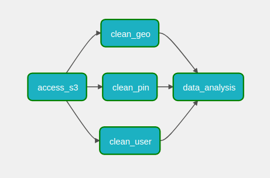

# Pinterest Data Pipeline

## Table of Contents
 - [Description](#description)
    * [Pipeline Architecture](#pipeline-architecture)
    * [Technologies Used](#technologies-used)
    * [Project Highlights](#project-highlights)
 - [Install Instructions](#install-instructions)
 - [Creating the Batch Pipeline](#creating-the-batch-pipeline)
    * [Kafka Client running on EC2](#kafka-client-running-on-ec2)
    * [MSK Connect](#msk-connect)
    * [API Gateway and Kafka REST Proxy](#api-gateway-and-kafka-rest-proxy)
    * [Pinterest User Posting Emulator](#pinterest-user-posting-emulator)
    * [Databricks and Spark](#databricks-and-spark)
    * [Airflow using AWS MWAA](#airflow-using-aws-mwaa)
 - [Creating the Streaming Pipeline](#creating-the-streaming-pipeline)
    * [Kinesis Data Streams](#kinesis-data-streams)
    * [API Gateway with Kinesis Integration](#api-gateway-with-kinesis-integration)
    * [Pinterest User Posting Emulator for Streaming](#pinterest-user-posting-emulator-for-streaming)
    * [Spark Streaming in Databricks](#spark-streaming-in-databricks)
 - [Usage Instructions](#usage-instructions)
 - [File Structure](#File-Structure)
 - [License](#License)


## Description
This project aims to use AWS Cloud to create a data pipeline similar to the one belonging to Pinterest that is capable of crunching billions of data points every day helping to decide how best to provide more value to their users.

### Pipeline Architecture
The pipeline implemented is a Lambda architecture where you have both a batch processing pipeline and a streaming pipeline in parallel.


#### Data Ingestion
Data is sent to the API using python scripts, which provide a real-time stream of data, ready to be ingested and processed. The scripts infinitely generate random Pinterest posts extracted from a database. In the batch pipeline, the API forwards the data to the Kafka Client machine where acting as a producer, it writes events to Kafka topics and MSK drops it in the AWS S3 data lake sink.
In the streaming pipeline, the API forwards the data to AWS Kinesis.

#### Data Processing
Apache Spark handles the data cleaning using PySpark running on Databricks. In the batch processing pipeline, the data is extracted from the S3 data lake and transformed with Spark. In the streaming pipeline, data is read into a Spark Streaming data frame from Kinesis, allowing for transformations to be applied in real-time.

#### Data Orchestration
Apache Airflow is a task scheduling system which allows tasks to be created and managed. The Spark cleaning tasks for the batch processing pipeline have been automated to run daily.

#### Data Storage
For the batch processing pipeline, data is stored in the S3 data lake before being subsequently processed. For the streaming pipeline, the transformations are applied to the incoming data stream. In both cases the cleaned data can be output to Delta tables in the Databricks Delta Lakehouse, back to S3 or anywhere else.

#### Data Analysis
Further computations were done on the data using Apache Spark on Databricks, including such metrics as most popular categories by country, year or age group and users with the most followers based on country, joining year and age group.

### Technologies Used:
- AWS Elastic Cloud Compute (EC2): Scalable on-demand computing capacity in the cloud.
- Apache Kafka: Used as a scalable and fault-tolerant messaging system for data streaming.
- AWS Managed Streaming for Apache Kafka (MSK): Managed service for Apache Kafka, providing easy setup, monitoring, and scaling capabilities.
- MSK Connect: Enables seamless data integration between Apache Kafka and other data sources and sinks.
- AWS API Gateway: Used to create, publish, and manage APIs, allowing external interaction with the pipeline.
- AWS S3: Scalable object storage used for data storage and retrieval.
- AWS Kinesis: Managed service for real-time data streaming and processing.
- Apache Spark: Fast and distributed processing engine used for data transformations and analytics.
- Apache Spark Structured Streaming: Enables real-time processing and analysis of streaming data.
- Databricks: Cloud-based platform for collaborative data engineering and analytics.
- Apache Airflow: Open-source platform for orchestrating and scheduling workflows.
- AWS Managed Workflows for Apache Airflow (MWAA): Fully managed service for Apache Airflow, simplifying the deployment and management of workflows.

### Project Highlights
- Developed a robust data processing pipeline capable of handling large scale data requirements. 
- Implemented a Lambda architecture, combining batch processing and stream processing methods. 
- Leveraged Kafka, MSK and Kinesis to handle scalable and fault-tolerant data streaming. 
- Utilized Spark and Spark Structured Streaming for batch and real-time data processing and analytics.
- Integrated various data sources and sinks using Python libraries, APIs and MSK Connect for seamless data integration.
- Enabled data storage and retrieval using AWS S3 and Databricks Delta Tables.
- Orchestrated and scheduled workflows using Airflow and MWAA for efficient pipeline management.

## Install Instructions
Although much of the work in this project is configuring the tech stack in the cloud, this repository contains implementation documentation and some python code to be run locally.

### Local Clone
To clone this Github repository, run the following: 
```bash
git clone https://github.com/RegnixS/pinterest-data-pipeline.git <your_repo>
```

The python code requires Python 3.11.5 and the following packages:
- python-dotenv
- requests
- sqlalchemy
- pymysql

A Conda environment can be created from the requirements.txt file in this repository by: 
```bash
conda create -n <your_env> --file requirements.txt
```

### Databricks Clone

To clone the Databricks notebooks in your own workspace, create a new ```Repo``` in your workspace using the repository URL: ```https://github.com/RegnixS/pinterest-data-pipeline.git```

## Creating the Batch Pipeline
The following is a step by step guide of how to create the batch pipeline.

### Kafka Client running on EC2 
A Kafka client is installed on an Amazon EC2 virtual machine. \
This machine will act as the client for the Brokers and Zookeeper servers running in AWS MSK (Managed Streaming for Apache Kafka). 

First, retrieve the key pair for the EC2 instance (in this case from the Parameter Store) and save it locally. \
This allows access to the EC2 instance using SSH.

The following components are installed on the EC2 instance:
- Java 1.8.0
```bash
sudo yum install java-1.8.0
```
- Kafka 2.12-2.8.1
```bash
wget https://archive.apache.org/dist/kafka/2.8.1/kafka_2.12-2.8.1.tgz  
tar -xzf kafka_2.12-2.8.1.tgz
```
- IAM MSK Authentication package
```bash
wget https://github.com/aws/aws-msk-iam-auth/releases/download/v1.1.5/aws-msk-iam-auth-1.1.5-all.jar
```

The path to the IAM MSK Authentication package's .jar file must be added to CLASSPATH in .bashrc.
```bash
export CLASSPATH=/home/ec2-user/kafka_2.12-2.8.1/libs/aws-msk-iam-auth-1.1.5-all.jar
```

An IAM role for the EC2 instance to access MSK needs to be configured and added to the client.properties file in the kafka*/bin directory as shown below:
```
# Sets up TLS for encryption and SASL for authN.
security.protocol = SASL_SSL

# Identifies the SASL mechanism to use.
sasl.mechanism = AWS_MSK_IAM

# Binds SASL client implementation.
sasl.jaas.config = software.amazon.msk.auth.iam.IAMLoginModule required awsRoleArn="<IAM Access Role>";

# Encapsulates constructing a SigV4 signature based on extracted credentials.
# The SASL client bound by "sasl.jaas.config" invokes this class.
sasl.client.callback.handler.class = software.amazon.msk.auth.iam.IAMClientCallbackHandler
```

The following Kafka topics are created using:
```bash
<KAFKA_FOLDER>/bin/kafka-topics.sh --bootstrap-server BootstrapServerString --command-config client.properties --create --topic <topic_name>
```
- 129a67850695.pin
- 129a67850695.geo
- 129a67850695.user

### MSK Connect
MSK Connect is a feature of AWS MSK that allows users to stream data to and from their MSK hosted Apache Kafka clusters. 

In this case, a sink connecter is created to move data into an Amazon S3 bucket.

The MSK cluster and S3 bucket are already provided so all we need to do is create the connector and associated plugin.

First create the custom plugin. \
The plugin contains code that defines the logic of the connector. These connectors already exist so we don't need to write the code for them. \
The one we are using is the **Confluent.io Amazon S3 Connector** which will export data from Kafka topics to S3 objects in either JSON, Avro or Bytes format.

Using the EC2 instance from earlier, download the plugin and upload it to the S3 bucket where MSK will be able to find it:
```bash
# assume admin user privileges
sudo -u ec2-user -i
# create directory where we will save our connector
mkdir kafka-connect-s3 && cd kafka-connect-s3
# download connector from Confluent
wget https://d1i4a15mxbxib1.cloudfront.net/api/plugins/confluentinc/kafka-connect-s3/versions/10.0.3/confluentinc-kafka-connect-s3-10.0.3.zip
# copy connector to our S3 bucket
aws s3 cp ./confluentinc-kafka-connect-s3-10.0.3.zip s3://<BUCKET_NAME>/kafka-connect-s3/
``` 
In the MSK console, select **Custom plugins** under the **MSK Connect** section. Choose **Create custom plugin**. \
For **S3 URI Custom plugin object**, find the ZIP file uploaded in the bucket and press **Create custom plugin**.

In the MSK console, select **Connectors** under the **MSK Connect** section. Choose **Create connector**. \
Select the plugin you have just created, and then click **Next**. \
The configuration settings of note are:
- **Connector configuration settings** 
```
connector.class=io.confluent.connect.s3.S3SinkConnector
# same region as our bucket and cluster
s3.region=us-east-1
flush.size=1
schema.compatibility=NONE
tasks.max=3
# include nomeclature of topic name, given here as an example will read all data from topic names starting with msk.topic....
topics.regex=<YOUR_UUID>.*
format.class=io.confluent.connect.s3.format.json.JsonFormat
partitioner.class=io.confluent.connect.storage.partitioner.DefaultPartitioner
value.converter.schemas.enable=false
value.converter=org.apache.kafka.connect.json.JsonConverter
storage.class=io.confluent.connect.s3.storage.S3Storage
key.converter=org.apache.kafka.connect.storage.StringConverter
s3.bucket.name=<BUCKET_NAME>
```
- **Worker Configuration** Select **Use a custom configuration**, then pick **confluent-worker**. (This is a custom worker configuration that was created to manage storage partition sizes.)
- **Access permissions** Select the IAM role previously used for the EC2 instance.

### API Gateway and Kafka REST Proxy
By installing a Confluent REST Proxy for Kafka on the EC2 instance, we can post data from the Pinterest emulator to a REST API on the Amazon API Gateway which in turn sends it via the proxy to update the Kafka topics on the MSK cluster without having to create and maintain producer programs locally on the EC2 instance. 

In the API Gateway console, create a REST type API with regional endpoint.

Create a proxy resource with an ```ANY``` method like so:


The **Endpoint URL** is the **Public IPv4 DNS** of the EC2 instance with the Kafka client. \
**8082** is the default port the Confluent REST Proxy listens to.

Creating a {proxy+} resource with HTTP proxy integration allows a streamlined setup where the API Gateway submits all request data directly to the backend with no intervention from API Gateway. \
All requests and responses are handled by the backend - in this case the Confluent REST Proxy on the EC2 instance.

Deploy the API:

Once deployed, the API is now accessible from the web.

Install the Confluent Kafka REST Proxy on the EC2 instance:
```bash
sudo wget https://packages.confluent.io/archive/7.2/confluent-7.2.0.tar.gz
tar -xvzf confluent-7.2.0.tar.gz
```
Configure the Kafka REST Proxy properties so it can comminucate with the MSK cluster, but updating the following file:
```bash
<CONFLUENT_FOLDER>/etc/kafka-rest/kafka-rest.properties
```
Update the ```bootstrap.servers``` and ```zookeeper.connect``` properties and also add the following to allow IAM authentication:
```
# Sets up TLS for encryption and SASL for authN.
client.security.protocol = SASL_SSL

# Identifies the SASL mechanism to use.
client.sasl.mechanism = AWS_MSK_IAM

# Binds SASL client implementation.
client.sasl.jaas.config = software.amazon.msk.auth.iam.IAMLoginModule required awsRoleArn="Your Access Role";

# Encapsulates constructing a SigV4 signature based on extracted credentials.
# The SASL client bound by "sasl.jaas.config" invokes this class.
client.sasl.client.callback.handler.class = software.amazon.msk.auth.iam.IAMClientCallbackHandler
```

Start the proxy server from the ```confluent-7.2.0/bin``` folder:
```bash
./kafka-rest-start /home/ec2-user/confluent-7.2.0/etc/kafka-rest/kafka-rest.properties
```

The Kafka related modules are now ready to accept data from our Pinterest users.

### Pinterest User Posting Emulator
#### Data Source
In a MySQL database hosted on Amazon RDS in the cloud there resides 1000s of sample datasets that represent the information a Pinterest user may generate as they interact with their app. 
There are 3 records per interaction representing 'pin' data, 'geo' (geolocation) data and 'user' data.

Example JSON formats of each dataset are as follows:
```
{"index": 10794, "unique_id": "c4bd2577-a7bb-4409-bb7a-17d5ed7e1cf1", "title": "TireBuyer", "description": "Nissan GT-R. Sick.", "poster_name": "Ray Uyemura", "follower_count": "437", "tag_list": "Lowrider,Old Vintage Cars,Antique Cars,Austin Martin,Nissan Gtr Black,Jaguar,1959 Cadillac,Cadillac Ct6,Old School Cars", "is_image_or_video": "image", "image_src": "https://i.pinimg.com/originals/0d/29/9f/0d299f3df020395aa7ce8387f40fbeed.jpg", "downloaded": 1, "save_location": "Local save in /data/vehicles", "category": "vehicles"}

{"ind": 10794, "latitude": -89.5236, "longitude": -154.567, "country": "Cocos (Keeling) Islands", "timestamp": "2022-01-01 02:26:50"}

{"ind": 10794, "first_name": "Thomas", "last_name": "Turner", "age": 34, "date_joined": "2016-12-22 00:02:02"}
```

The python program **user_posting_emulation.py** will infinitely read random datasets from the remote database at random intervals and then, using the ```requests``` python library, post them to the API we built earlier.

To run this program: 
```bash
python user_posting_emulation.py
```

#### Testing whether data is ingested by Kafka
To test whether the emulation is working, the python program **check_user_posting_emulation.py** will create Kafka consumers using the API and then consume the messages and output them to the JSON files: 
- pin_consumer.json
- geo_consumer.json
- user_consumer.json

To run this program: 
```bash
python check_user_posting_emulation.py
```

The emulation can also be tested by running a consumer from the command line like so: 
```bash
./kafka-console-consumer.sh --bootstrap-server BootstrapServerString --consumer.config client.properties --group <consumer_group> --topic <topic_name> --from-beginning
```
The CLI command must be run on the EC2 instance where Kafka is installed, but the python programs can be run from any python environment anywhere there is an internet connection.

#### Testing Data has been ingested and stored in S3
To see if the data has gone through Kafka via MSK and MSK Connect, we can look in the S3 data lake. \
E.g: 


### Databricks and Spark
#### Accessing the S3 bucket from Databricks
In order to access the S3 bucket containing the Kafka topics data, we first need to allow access to the bucket. 
To do this we first need to create a user in IAM for the AWS account for Databricks to access. 
Attach the existing permission policy ```S3FullAccess```.
In **Security Credentials** for this user, **Create Access Key**.
Download the key as CSV file.
In the Databricks UI click **Catalog** and **Create Table**.
Drop the key CSV file in the space and click **Create Table with UI**.

Now that the access keys are available from within the Databricks file store, we can use them in our notebooks.

Notebooks are created in Databricks as .py files, but they have been converted to .ipynb files for readabilty outside of Databricks.

In some notebooks, resultant dataframes have been copied to Global Temporary Views to make them available to other notebooks. In these cases, "129a67850695" has been added to the name so other developers will not overwrite them by using similar names.

**AWS Access Utils.ipynb** accesses the authentication keys file in the Databricks file store and loads the keys to a dataframe. \
This notebook also defines the functions to access AWS S3 data or AWS Kinesis streams. \
The function definitions do not manipulate data, so the code runs very quickly. Therefore it doesn't matter if they are run in notebooks that don't need them.

Note: This notebook has to be in the same folder as the calling notebook.

**Mount S3 Bucket.ipynb** performs the following tasks:
- Runs the **AWS Access Utils.ipynb** notebook inline to access the keys using: ```%run "./AWS Access Utils"```
- Mount the S3 bucket using the bucket URI and keys.
- Read the pin data from: ```/mnt/<bucket_name>/topics/129a67850695.pin/partition=0/```
- Read the geo data from: ```/mnt/<bucket_name>/topics/129a67850695.geo/partition=0/```
- Read the user data from: ```/mnt/<bucket_name>/topics/129a67850695.user/partition=0/```
- Copy the dataframes to Global Temporary Views.

**Unmount S3 Bucket.ipynb** will unmount the bucket after we are done with it. This would normally be after all the processing has been done using the data in the bucket.

#### Access S3 Buckets Without Mounting
While working on the project I discovered that Databricks no longer recommends mounting external data sources to the Databricks filesystem, so I made a new notebook. [See link.](https://docs.databricks.com/en/connect/storage/amazon-s3.html#deprecated-patterns-for-storing-and-accessing-data-from-databricks)

**Access S3 Without Mounting.ipynb** performs the following tasks similar to the previous notebook, but reads directly from the S3 bucket using the access keys and S3 URI without needing a mount:
- Runs the **AWS Access Utils.ipynb** notebook inline to access the keys using: ```%run "./AWS Access Utils"```
- Read the pin data from: ```s3n://<bucket_name/topics/129a67850695.pin/partition=0/``` 
- Read the geo data from: ```s3n//<bucket_name>/topics/129a67850695.geo/partition=0/```
- Read the user data from: ```s3n//<bucket_name>/topics/129a67850695.user/partition=0/```
- Copy the dataframes to Global Temporary Views.

#### Cleaning and Transforming the Data
The cleaning of the incoming data is done in three separate notebooks. One for Pin data, one for Geo (location) data and one for user data.

**Cleaning Utils** 
This notebook defines a function to set up the widget for batch or streaming mode and drops duplicates. \
It also has a function to save a cleaned dataframe to a global temporary view. \
It is called from all the cleaning notebooks and must be in the same folder.

**Clean Pin Data.ipynb** performs the following transformations:
- Drop duplicates
- Replace entries with no relevant data in each column with Nulls
- Perform the necessary transformations on the follower_count to ensure every entry is a number and the data type of this column is integer
- Clean the data in the save_location column to include only the save location path
- Rename the index column to ind
- Reorder the dataframe

**Clean Geo Data.ipynb** performs the following transformations:
- Drop duplicates
- Create new coordinates column based on latitiude and longtitude
- Drop latitude and longtitude
- Convert timestamp to timestamp data type
- Reorder the dataframe

**Clean User Data.ipynb** performs the following transformations:
- Drop duplicates
- Combine first and last names
- Drop first_name and last_name
- Convert date_joined to timestamp data type
- Reorder the dataframe

#### Data Analysis Using Spark
In the notebook **Data Analysis.ipynb**, Spark was used to analyse the cleaned and transformed data in order to help inform business users of some examples of potentially valuable metrics that can be derived from such data.

The following queries were made using pySpark functions:
- Most popular category in each country
- Most popular category each year
- Most followers in each country
- Most popular category for different age groups
- Median follower count for different age groups
- How many users have joined each year
- Median follow count of users based on their joining year
- Median follow count of users based on their joining year and age group

### Airflow using AWS MWAA
To orchestrate the workflows in Databricks we use Airflow running in Amazon's Managed Workflows for Apache Airflow (MWAA).

Normally to configure MWAA to work with Databricks, we would need to do the following:
1. Generate an access token in Databricks.
2. Upload a requirements.txt file to an S3 bucket to let MWAA know the python libraries required to create a Databricks connection. This requirements.txt file will contain: ```apache-airflow[databricks]```.
3. Specify the S3 bucket to the MWAA environment. As well as the requirements.txt location, this is also where the DAGs folder is located.
4. Create a **connection** in the Airflow UI to connect to Databricks using the Databricks host URL and the access token.

For this project, this has already been done so we need only create the DAG (Directed Acyclic Graph) to orchestrate the Databricks workflow and upload it to the DAGs folder in the S3 bucket.

The DAG **129a67850695_dag.py** is in this repository in the folder **dags**.
It will run the notebook: **Access S3 Without Mounting**, then the cleaning notebooks: **Clean Pin Data**, **Clean Geo Data**, and **Clean User Data**. After all these are finished, it will run notebook: **Data Analysis**. \
The full Databricks pathnames have to be defined in each case
```/Repos/rgducke@gmail.com/pinterest-data-pipeline/databricks_notebooks/<notebook_name>``` 

The DAG is set to run daily, but can be run on demand.

The dependency graph is below: \


The DAG has been run successfully a few times as shown below: \


## Creating the Streaming Pipeline
Below are the steps required to create the streaming pipeline.

### Kinesis Data Streams
In the AWS Kinesis console three new **Data Streams** are created as shown: 


### API Gateway with Kinesis Integration
The API Gateway we created earlier will also be used to ingest the data for the Kinesis streams. 
Unlike the proxy integration for Kafka where all requests are handled by the client, we have to define all the requests and the integration with Kinesis.

First we create the ```streams``` resource:


Under this we create the ```GET``` method for the Kinesis action ```ListStreams```.


The **Execution role** here is an IAM role that can assume the **AmazonKinesisFullAccessRole** policy so API Gateway can perform Kinesis actions such as listing and describing streams and putting data to them.

From here we edit the **integration request** and define the following:
- **URL request headers parameters** 
   * **Name** Content-Type
   * **Mapped form type** 'application/x-amz-json-1.1'
- **Mapping Templates**
   * **Content Type** application-json
   * **Template Body** 
      ```
      {
         "ExclusiveStartStreamName": #if($input.params('ExclusiveStartStreamName') == '') "-" #else "$input.params('ExclusiveStartStreamName')" #end,
         "Limit": #if($input.params('Limit') == '') 100 #else $input.params('Limit') #end
      }
      ```

Under the ```streams``` resource, we create the child resource ```{stream-name}``` under which we create the three methods: ```GET```, ```POST``` and ```DELETE```. 

The methods and integration requests are created in the same way as the ```GET``` method for ```ListStreams``` except for the following differences: 

For ```GET```:
- **Action Name** ```DescribeStream```
- **Mapping Templates**
   * **Template Body** 
      ```
      {
         "StreamName": "$input.params('stream-name')"
      }
      ```

For ```POST```:
- **Action Name** ```CreateStream```
- **Mapping Templates**
   * **Template Body** 
      ```
      {
         "ShardCount": #if(input.path('.ShardCount') == '') 5 #else input.path('.ShardCount') #end, 
         "StreamName": "$input.params('stream-name')"
      }
      ```

For ```DELETE```:
- **Action Name** ```DeleteStream```
- **Mapping Templates**
   * **Template Body** 
      ```
      {
         "StreamName": "$input.params('stream-name')"
      }
      ```
Under the ```{stream-name}``` resource, we create two child resources ```record``` and ```records```. For both of these we create a ```PUT``` method.

The methods and integration requests are created in the same way as the methods above except for the following differences: 

```PUT``` for ```record```:
- **Action Name** ```PutRecord```
- **Mapping Templates**
   * **Template Body** 
      ```
      {
         "StreamName": "$input.params('stream-name')",
         "Data": "$util.base64Encode($input.json('$.Data'))",
         "PartitionKey": "$input.path('$.PartitionKey')"
      }
      ```
```PUT``` for ```records```:
- **Action Name** ```PutRecords```
- **Mapping Templates**
   * **Template Body** 
      ```
      {
         "StreamName": "$input.params('stream-name')",
         "Records": [
            #foreach(elemininput.path('$.records'))
               {
                  "Data": "util.base64Encode(elem.data)",
                  "PartitionKey": "$elem.partition-key"
               }#if($foreach.hasNext),#end
            #end
         ]
      }
      ```

The finished API should look like this:


Finally, deploy the API so it can be accessed from the web.


### Pinterest User Posting Emulator for Streaming

The python program **user_posting_emulation_streaming.py** in the same way as **user_posting_emulation.py**, will infinitely read random datasets from the remote database at random intervals and then, using the ```requests``` python library, post them to the new API we built for Kinesis.

It will post data one record at a time to the ```PUT``` method of the resource ```/stream/{stream-name}/record``` for the Kinesis action ```PutRecord```.

The ```GET``` methods for the actions ```ListStreams``` and ```DescribeStreams``` have also been implemented in the program for testing purposes.

I extended the mapping template in the API integration for Kinesis for ```ListStreams``` to include the input parameters ```ExclusiveStartStreamName``` and ```Limit``` so we can start the list of streams at and only show the three streams that we created (beginning with 129a67850695).

To run this program: 
```bash
python user_posting_emulation_streaming.py
```
Once the data is sent to the API, we can visualize it in Kinesis as shown below:


### Spark Streaming in Databricks
#### Batch notebooks used in the streaming pipeline
The same notebook **AWS Access Utils.ipynb** is used to access the AWS credentials needed for the Kinesis streams.

The cleaning notebooks **Clean Pin Data.ipynb**, **Clean Geo Data.ipynb** and **Clean User Data.ipynb** have also been modified so they can be used by both batch and streaming pipelines. 

Each of these notebooks have had a widget named ```mode``` added with a value defaulted to "Batch". \
This allows the notebooks to behave in exactly the same way as before, including when being run from the DAG in Airflow. \
The difference is that these notebooks can be run from another notebook with the parameter for ```mode``` set to "Stream" like so:
```
%run "./Clean xxx Data" $mode="Stream"
```
By doing so, they can perform the same cleaning functions using the streaming dataframes instead of the batch ones. \
Note: The called notebook has to be in the same folder as the calling notebook.

#### Spark Streaming Notebook
**Kinesis Streaming.ipynb** executes the following processes:
- Get the AWS authentication key file using **AWS Access Utils.ipynb**
- Read the pin Kinesis stream
- Clean the pin data using **Clean Pin Data.ipynb**
- Save pin to a delta table
- Read the geo Kinesis stream
- Clean the geo data using **Clean Geo Data.ipynb**
- Save geo to a delta table
- Read the user Kinesis stream
- Clean the user data using **Clean User Data.ipynb**
- Save user to a delta table

#### Saving the Streamed Data in Delta Tables
The streamed data can be seen in the Databricks File Store as shown below:


The pipelines are now complete.

## Usage instructions
### Python files
**user_posting_emulation.py** :  This program will infinitely read random datasets from the remote database at random intervals and then post them to the API Gateway for batch data.

To run this program: 
```bash
python user_posting_emulation.py
```
**check_user_posting_emulation.py** :  This program tests whether the emulation is working by creating Kafka consumers using the API and then consuming the messages and outputing them to JSON files.

To run this program: 
```bash
python check_user_posting_emulation.py
```
The output is saved in the files:
- geo_consumer.json
- pin_consumer.json
- user_consumer.json

**user_posting_emulation_streaming.py** :  This program will infinitely read random datasets from the remote database at random intervals and then post them to the API Gateway for Kinesis streaming.

To run this program: 
```bash
python user_posting_emulation_streaming.py
```
### Databricks notebooks
Within the Databricks workspace navigate to the following location:
```/Repos/<your_username>/<your_repo>/databricks_notebooks/``` \
e.g: 
```/Repos/rgducke@gmail.com/pinterest-data-pipeline/databricks_notebooks/```

To process the batch pipeline, run the following notebooks in order:
1. **Access S3 Without Mounting**
2. **Clean Pin Data**
3. **Clean Geo Date**
4. **Clean USer Data**
5. **Data Analysis**

Alternatively, trigger the DAG ```129a67850695_dag``` in the MWAA Airflow UI.

To process the streaming pipeline, run the following notebook:
1. **Kinesis Streaming**

## File structure of the project:
Local Machine \
|-- dags/ \
&nbsp;&nbsp;&nbsp;&nbsp;|-- 129a67850695_dag.py \
|-- databricks_notebooks/ \
&nbsp;&nbsp;&nbsp;&nbsp;|-- Access S3 Without Mounting.ipynb \
&nbsp;&nbsp;&nbsp;&nbsp;|-- AWS Access Utils.ipynb \
&nbsp;&nbsp;&nbsp;&nbsp;|-- Clean Geo Data.ipynb \
&nbsp;&nbsp;&nbsp;&nbsp;|-- Clean Pin Data.ipynb \
&nbsp;&nbsp;&nbsp;&nbsp;|-- Clean User Data.ipynb \
&nbsp;&nbsp;&nbsp;&nbsp;|-- Cleaning Utils \
&nbsp;&nbsp;&nbsp;&nbsp;|-- Data Analysis.ipynb \
&nbsp;&nbsp;&nbsp;&nbsp;|-- Kinesis Streaming.ipynb \
&nbsp;&nbsp;&nbsp;&nbsp;|-- Mount S3 Bucket.ipynb \
&nbsp;&nbsp;&nbsp;&nbsp;|-- Unmount S3 Bucket.ipynb \
|-- .env.example \
|-- check_user_posting_emulation.py \
|-- README.md \
|-- requirements.txt \
|-- user_posting_emulation.py \
|-- user_posting_emulation_streaming.py \

EC2 Instance
|-- kafka_2.12-2.8.1/ \
&nbsp;&nbsp;&nbsp;&nbsp;|-- bin/ \
&nbsp;&nbsp;&nbsp;&nbsp;&nbsp;&nbsp;&nbsp;&nbsp;|-- client.properties \
&nbsp;&nbsp;&nbsp;&nbsp;|-- libs/ \
&nbsp;&nbsp;&nbsp;&nbsp;&nbsp;&nbsp;&nbsp;&nbsp;|-- aws-msk-iam-auth-1.1.5-all.jar \
|-- kafka-connect-s3/ \
&nbsp;&nbsp;&nbsp;&nbsp;|-- confluentinc-kafka-connect-s3-10.0.3.zip \
|-- confluent-7.2.0/ \
&nbsp;&nbsp;&nbsp;&nbsp;|-- etc/ \
&nbsp;&nbsp;&nbsp;&nbsp;&nbsp;&nbsp;&nbsp;&nbsp;|-- kafka-rest/ \
&nbsp;&nbsp;&nbsp;&nbsp;&nbsp;&nbsp;&nbsp;&nbsp;&nbsp;&nbsp;&nbsp;&nbsp;|-- kafka-rest.properties 

## License information:
MIT License

Copyright (c) 2024 Robert Ducke

Permission is hereby granted, free of charge, to any person obtaining a copy
of this software and associated documentation files (the "Software"), to deal
in the Software without restriction, including without limitation the rights
to use, copy, modify, merge, publish, distribute, sublicense, and/or sell
copies of the Software, and to permit persons to whom the Software is
furnished to do so, subject to the following conditions:

The above copyright notice and this permission notice shall be included in all
copies or substantial portions of the Software.

THE SOFTWARE IS PROVIDED "AS IS", WITHOUT WARRANTY OF ANY KIND, EXPRESS OR
IMPLIED, INCLUDING BUT NOT LIMITED TO THE WARRANTIES OF MERCHANTABILITY,
FITNESS FOR A PARTICULAR PURPOSE AND NONINFRINGEMENT. IN NO EVENT SHALL THE
AUTHORS OR COPYRIGHT HOLDERS BE LIABLE FOR ANY CLAIM, DAMAGES OR OTHER
LIABILITY, WHETHER IN AN ACTION OF CONTRACT, TORT OR OTHERWISE, ARISING FROM,
OUT OF OR IN CONNECTION WITH THE SOFTWARE OR THE USE OR OTHER DEALINGS IN THE
SOFTWARE.